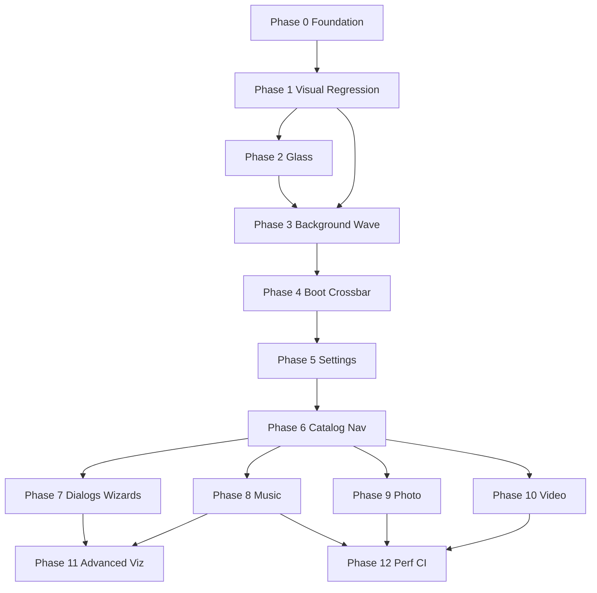

# xmb-web Visual & Behavioral Parity — Multi-Repo Implementation Plan

> **For agentic workers:** REQUIRED SUB-SKILL: Use `superpowers:subagent-driven-development` (recommended) or `superpowers:executing-plans` to implement this plan phase-by-phase. Steps use checkbox (`- [ ]`) syntax for tracking.

**Goal:** Bring OpenXMB to one-to-one visual and behavioral parity with the pinned xmb-web reference, using AuroreEngine as the Vulkan renderer substrate, while preserving clean-build fallbacks and GPL/MPL licensing boundaries.

**Architecture:** Treat xmb-web as the immutable reference spec. Port behavior into OpenXMB as typed native data (`assets/xmb/catalog/en.json`) and contract-tested C++ samplers. Import reference assets locally via `tools/xmb/import_xmb_web.py` (never redistributed). Extend AuroreEngine only for cross-cutting renderer capabilities (glass icons, compositing hooks, media texture paths). Verify with native unit tests first, then pixel-diff gates (`tools/xmb/compare_frames.py`).

**Tech Stack:** C++23 modules, Vulkan (AuroreEngine/dreamrender), SDL2, FFmpeg, CMake/Ninja, Python 3 (import/compare tooling), pinned xmb-web checkout.

## Global Constraints

- **Reference commit (pinned):** `5d4675366ad50deca14fe3d70a2aa646c341aee0` — `TheGammaSqueeze/xmb-web`
- **Active branches:** `RSX-26` on OpenXMB and AuroreEngine (keep in sync; push after each phase gate)
- **Local paths (Windows dev):**
  - OpenXMB: `%USERPROFILE%/Developer/OpenXMB`
  - AuroreEngine: `%USERPROFILE%/Developer/AuroreEngine`
  - xmb-web: `%USERPROFILE%/Developer/xmb-web`
- **Build preset:** `windows-native` (sets `DREAMRENDER_LOCAL`, `OPENXMB_IMPORT_XMB_WEB_COMPAT=ON`, `OPENXMB_XMB_WEB_SOURCE`)
- **Clean-build fallback:** When compat pack absent, Original wave falls back to licensed RetroArch Classic wave (`identity-assets.json`)
- **Excluded from import:** `globe_assets/**`, `music/**`, PS3 boot logo, Rodin fonts, xmb-web sound files
- **Resolution anchor:** 1920×1080 virtual framebuffer; layout containment for 4:3, 21:9, portrait
- **Test discipline:** Contract test before presenter; pixel threshold after visual change
- **Licensing:** Do not commit unresolved firmware-extracted assets; manifest provenance tiers are authoritative

---

## Ecosystem Map

### Repositories & Roles

| Repo | Branch | Remote | Responsibility |
|------|--------|--------|----------------|
| **xmb-web** | `master` @ `5d4675366a...` | `TheGammaSqueeze/xmb-web` | Ground-truth visuals, measured layout constants, shaders (GLSL), catalog tree, demo media references |
| **OpenXMB** | `RSX-26` (+11 local) | `phenom64/OpenXMB` | Application shell, catalog port, boot timeline, wave/particle/background shaders, navigation FSM, media state machines, compat import, blur compositor |
| **AuroreEngine** | `RSX-26` (+2 local + WIP) | `phenom64/AuroreEngine` | Vulkan GUI substrate: `gui_renderer`, `image_renderer` (incl. glass), `font_renderer`, `simple_renderer`, resource loader, headless window |

### Dependency Flow

```
xmb-web (reference)
    │
    ├─► import_xmb_web.py ──► build/.../shell/compat/xmb-ui-compat/
    │
    ├─► catalog extraction ──► assets/xmb/catalog/en.json
    │
    └─► measured constants ──► tests/xmb/*_tests.cpp

AuroreEngine (RSX-26) ◄── DREAMRENDER_LOCAL ── OpenXMB (RSX-26)
         │                                        │
         └─ draw_image_glass, fonts, 2D primitives ┘
              ▲
              └── setGlassBackground/Material wired in shell.cpp
```

---

## Previous Agent Workflow (Crumbs Left Behind)

The prior agent did **not** leave a single markdown design doc. Instead they established a **toolchain + contract-test workflow**:

### 1. Asset import manifest (`assets/xmb/manifests/xmb-web-source.json`)

- SHA-256 pinned file list for wave binaries, particle source, icon families
- `import_xmb_web.py` validates formats (WSQ2, WBT1, month table extraction)
- Output: `compat/xmb-ui-compat/manifest.json` (local build only)
- Fallback policy documented in manifest: `classic` wave when compat absent

### 2. Identity manifest (`assets/xmb/manifests/identity-assets.json`)

- Licensed Play fonts, NSE sounds, RetroArch Classic wave shaders
- Startup identity string: `"Syndromatic Limited Bharat Britannia"` (SHA-256 gated)

### 3. Visual regression thresholds (`assets/xmb/manifests/visual-thresholds.json`)

- Four registered 1920×1080 scenes: `root`, `settings`, `theme`, `theme-panel`
- Metrics: MAE ≤ 0.06, RMSE ≤ 0.12, P95 ≤ 0.20, fraction_pixels_over_32 ≤ 0.18
- Tool: `tools/xmb/compare_frames.py` (not wired to CI)

### 4. Contract test suite (`tests/xmb/`)

| Test | Locks |
|------|-------|
| `layout_timeline_tests.cpp` | Boot timeline 16.9s, layout transforms, root_scene geometry |
| `live_crossbar_contract_tests.cpp` | 9 categories, measured anchors |
| `wave_data_tests.cpp` | Wave binary parse/sample (needs `../xmb-web`) |
| `background_tests.cpp` | Month gradient anchors, shader strings |
| `catalog_state_tests.cpp` | Full en.json tree, navigation FSM |
| `settings_*_tests.cpp` | Settings layout, controller, action firewall |
| `status_bar_tests.cpp` | Clock metrics |
| `identity_tests.cpp` | Identity assets |

### 5. RSX-26 commit history (parity rebuild)

**OpenXMB** (since `94a2116 Start native XMB parity rebuild`):

1. `d9028cd` — Original particles + settings action firewall
2. `cdea32e` — Catalog-backed settings controller
3. `836e956` — Live Settings catalog seam
4. `3e22c43` — Settings choice panel seam
5. `c7e9e0d` — Original colours + glass defaults
6. `1b87ff9` — xmb-web settings dialogs + glass icons
7. `2618f4a` — Day/Night theme mode
8. `b2e661c` — Settings side panel chooser tuning
9. `3a8158f` — Settings top actions
10. `f0fa7f0` — Boot text layout
11. `486cea9` — Particle band tuning

**AuroreEngine**:

1. `048c605` — v2 substrate contracts (`minimal_draw_list`, `aurore::core::time`)
2. `e07477b` — Icon glass compositing pipeline
3. `abbe444` — xmb-web normal-map glass path
4. **Uncommitted WIP:** ambient/env map samplers, refractive offset tuning in `image_renderer.glass.frag`

### 6. CMake integration

- `OPENXMB_IMPORT_XMB_WEB_COMPAT` (OFF by default, ON in `windows-native`)
- `OPENXMB_XMB_WEB_SOURCE` cache path
- `DREAMRENDER_LOCAL` for local AuroreEngine
- `openxmb_compat_assets` custom target copies pack into build tree

### 7. Milestones doc (`milestones.txt`)

Older roadmap (M1–M8) predates xmb-web parity; still valid for release hygiene (M8 perf pass) but does not enumerate xmb-web feature parity.

---

## Current State Assessment (2026-06-29)

### Done (~45% combined parity)

| Area | OpenXMB | AuroreEngine | Notes |
|------|---------|--------------|-------|
| Catalog data model | ✅ 90% | — | 214 nodes, 51 dialogs, 120 wizards in `en.json` |
| Navigation FSM | ✅ tested | — | Not primary UI path yet |
| Boot timeline + overlay | ✅ 85% | — | Identity replaces PS3 logo (intentional) |
| Original background gradient | ✅ | — | `monthly_background.frag` |
| Captured wave + particles | ✅ 75% | — | Needs compat pack |
| Crossbar geometry constants | ✅ | — | Legacy menu stack still renders |
| Status bar / clock | ✅ | — | Contract-tested |
| Settings (partial live) | ✅ 55% | glass ✅ 70% | `choice_overlay` not full side panels |
| NSE UI sounds | ✅ | — | Navigate/confirm/cancel/startup |
| Icon glass infrastructure | ✅ wired | ✅ WIP | Joint shader tuning needed |
| Media state machines | ✅ models | — | No shell presenters |

### Not started / major gaps

- Full catalog-driven UI for Photo/Music/Video/Game/Network/PSN/Friends
- 120 wizard presenters + OSK
- 51 dialogs (only theme subset live)
- Music player UI + 3 visualizers
- Photo browser/viewer/slideshow (xmb-web style)
- Video player transport panel (xmb-web style)
- Content-info hover backgrounds, landing cards
- Visual regression CI automation
- AuroreEngine: audio stream API, offscreen FBO helper, video texture path
- v2 `minimal_draw_list` unused in production path

---

## Phase Overview

| Phase | Name | Primary Repo | Gate |
|-------|------|--------------|------|
| **0** | Tri-Repo Foundation | Both + xmb-web | Green `ctest`, compat pack imported, branches pushed |
| **1** | Visual Regression Harness | OpenXMB | Automated `compare_frames` for `root` scene |
| **2** | Icon Glass Parity | AuroreEngine + OpenXMB | Glass icons pass visual threshold on `root` |
| **3** | Background & Wave Polish | OpenXMB | `root` + `settings` scenes within thresholds |
| **4** | Boot & Crossbar Animation | OpenXMB | Boot timeline visual match; crossbar transitions |
| **5** | Settings & Theme Dialogs | OpenXMB | `theme` + `theme-panel` scenes pass |
| **6** | Catalog Navigation Unification | OpenXMB | All 9 categories via `NavigationState` |
| **7** | Dialog & Wizard Framework | OpenXMB | System Information wizard live; modal routing |
| **8** | Music Player | OpenXMB + AuroreEngine | Browser + Now Playing + XMB Waves visualizer |
| **9** | Photo App | OpenXMB | Grouping, viewer, slideshow, control panel |
| **10** | Video Player | OpenXMB + AuroreEngine | Transport panel, chapters, screen modes |
| **11** | Advanced Visualizers & Globe | Both | Canyon/Globe music viz; TZ globe wizard |
| **12** | Performance, CI & Release | Both | M8 acceptance; CI matrix with compat verify |

Phases 0–5 are **visual shell** (highest ROI). Phases 6–7 are **architectural keystone**. Phases 8–10 are **media apps**. Phase 11 is optional depth. Phase 12 is ongoing but formalized at end.

---

## Phase 0: Tri-Repo Foundation

**Goal:** Establish a reproducible dev loop across all three checkouts before any feature work.

**Repos:** OpenXMB `RSX-26`, AuroreEngine `RSX-26`, xmb-web @ `5d4675366a...`

### Task 0.1: Commit AuroreEngine glass WIP

**Files:**
- Modify: `AuroreEngine/shaders/image_renderer.glass.frag`
- Modify: `AuroreEngine/src/components/image_renderer.cppm`

- [ ] **Step 1:** Review uncommitted diff (`git diff` in AuroreEngine)
- [ ] **Step 2:** Rebuild AuroreEngine examples to confirm glass pipeline compiles
  ```powershell
  cd %USERPROFILE%/Developer/AuroreEngine
  cmake --preset windows-vcpkg-dev
  cmake --build --preset windows-vcpkg-dev
  ```
- [ ] **Step 3:** Commit with message `Tune icon glass ambient/env maps toward xmb-web`
- [ ] **Step 4:** Push `RSX-26` to origin

### Task 0.2: Push OpenXMB RSX-26 baseline

**Files:** (none — git only)

- [ ] **Step 1:** Run full native test suite
  ```powershell
  cd %USERPROFILE%/Developer/OpenXMB
  cmake --preset windows-native
  cmake --build --preset windows-native
  ctest --test-dir build/native -R openxmb_ --output-on-failure
  ```
- [ ] **Step 2:** Verify compat pack exists at `build/native/shell/compat/xmb-ui-compat/manifest.json`
- [ ] **Step 3:** Push 11 unpushed commits on `RSX-26`

### Task 0.3: Verify xmb-web pin

**Files:**
- Read: `OpenXMB/assets/xmb/manifests/xmb-web-source.json`
- Read: `OpenXMB/assets/xmb/catalog/en.json` (source commit field)

- [ ] **Step 1:** Confirm xmb-web HEAD matches pinned commit
  ```powershell
  cd %USERPROFILE%/Developer/xmb-web
  git rev-parse HEAD
  # Expected: 5d4675366ad50deca14fe3d70a2aa646c341aee0
  ```
- [ ] **Step 2:** Run import verify-only
  ```powershell
  python tools/xmb/import_xmb_web.py --source %USERPROFILE%/Developer/xmb-web `
    --output %TEMP%/xmb-compat-verify --verify-only
  ```
  Expected: JSON summary with `"mode": "verify-only"`, exit 0

### Task 0.4: Document dev loop (README snippet)

**Files:**
- Modify: `OpenXMB/README.md` (short "Parity Development" section)

- [ ] **Step 1:** Add section listing the three paths, `windows-native` preset, test command, compare_frames usage
- [ ] **Step 2:** Commit `docs: add parity dev loop to README`

**Phase 0 Gate:** All `openxmb_*` tests pass; compat import verify-only succeeds; both RSX-26 branches pushed.

---

## Phase 1: Visual Regression Harness

**Goal:** Automate pixel-diff verification so visual tuning has an objective score.

**Repos:** OpenXMB (primary), xmb-web (reference captures)

### Task 1.1: Reference frame capture procedure

**Files:**
- Create: `tools/xmb/capture_native_frame.md` (procedure doc)
- Modify: `OpenXMB/src/app/shell.cpp` (ensure `OPENXMB_HEADLESS_STARTUP` + fixed boot seconds work)

- [ ] **Step 1:** Document capture states:
  - `root`: boot complete, Users focused, Original theme, June afternoon
  - `settings`: Settings submenu, System Settings focused
  - `theme`: Theme Settings item focused
  - `theme-panel`: Theme → Theme dialog open (Original selected)
- [ ] **Step 2:** Confirm env vars from `layout_timeline_tests.cpp`:
  - `OPENXMB_HEADLESS_STARTUP=1`
  - `OPENXMB_FIXED_BOOT_SECONDS=17.0` (or scene-appropriate freeze time)
- [ ] **Step 3:** Add script `tools/xmb/capture_frame.ps1` wrapping headless launch + screenshot hook (or manual PNG drop folder)

### Task 1.2: Store reference PNGs (local-only)

**Files:**
- Create: `tests/xmb/reference_frames/` (gitignored)
- Modify: `OpenXMB/.gitignore` → add `tests/xmb/reference_frames/`

- [ ] **Step 1:** Capture reference PNGs from xmb-web at 1920×1080 for each scene (browser screenshot)
- [ ] **Step 2:** Verify SHA-256 matches `visual-thresholds.json` `reference_sha256` fields
- [ ] **Step 3:** Document in capture procedure if hashes differ (threshold file may need update)

### Task 1.3: Compare script integration

**Files:**
- Create: `tools/xmb/run_visual_regression.ps1`
- Test: manual invocation

- [ ] **Step 1:** Script calls `compare_frames.py` per scene, writes JSON reports to `build/visual-regression/`
- [ ] **Step 2:** Exit non-zero if any scene fails
- [ ] **Step 3:** Optional `--heatmap` for debugging

### Task 1.4: CTest optional target

**Files:**
- Modify: `OpenXMB/CMakeLists.txt`

- [ ] **Step 1:** Add `OPENXMB_VISUAL_REGRESSION=ON` option (OFF default)
- [ ] **Step 2:** When ON + reference frames present, register `openxmb_visual_regression` test
- [ ] **Step 3:** CI remains OFF until reference frames are publishable or CI captures them

**Phase 1 Gate:** `run_visual_regression.ps1` produces metric JSON for all 4 scenes; team can iterate on `root` MAE number.

---

## Phase 2: Icon Glass Parity

**Goal:** Category and item icons match xmb-web glass material at 1920×1080.

**Repos:** AuroreEngine (shader), OpenXMB (normal-map loading, composited background)

### Task 2.1: Glass shader golden values

**Files:**
- Modify: `AuroreEngine/shaders/image_renderer.glass.frag`
- Create: `AuroreEngine/tests/shaders/glass_constants.hpp` (documented xmb-web constants)

- [ ] **Step 1:** Extract xmb-web `initIconGlass()` constants from `xmb-web/index.html` (light dirs, fresnel, spec powers, chromatic offsets, tonemap)
- [ ] **Step 2:** Align shader literals; add comment citing xmb-web line region
- [ ] **Step 3:** Rebuild OpenXMB against local AuroreEngine

### Task 2.2: Normal-map resolver for all icons

**Files:**
- Modify: `OpenXMB/src/app/components/main_menu.cpp` (`resolve_compat_icon_ref`, glass texture load)
- Modify: `OpenXMB/src/menu/users_menu.cpp`

- [ ] **Step 1:** Audit icon_ref → `normalmaps/nmap_NNN.png` mapping for all 92 compat icons
- [ ] **Step 2:** Ensure glass draw path uses normal map, flat icon as CPU fallback only
- [ ] **Step 3:** Add test in `tests/xmb/identity_tests.cpp` or new `icon_resolver_tests.cpp` for mapping consistency

### Task 2.3: Composited background quality for refraction

**Files:**
- Modify: `OpenXMB/src/app/shell.cpp` (background composite path before `setGlassBackground`)

- [ ] **Step 1:** Verify `compositedBackgroundView` includes gradient + wave + particles (not black)
- [ ] **Step 2:** Fix ordering if glass samples before wave render completes
- [ ] **Step 3:** Visual compare icon refraction on active vs inactive category

### Task 2.4: Settings glass parity

**Files:**
- Modify: `OpenXMB/src/xmb/renderer/settings_scene_renderer.cppm`

- [ ] **Step 1:** Confirm settings rows use same glass path as crossbar
- [ ] **Step 2:** Tune tint/opacity for focused row glow interaction

**Phase 2 Gate:** `root` scene MAE ≤ 0.06 (or documented delta with heatmap); icons visibly refract background.

---

## Phase 3: Background & Wave Polish

**Goal:** Original theme background (gradient + wave + particles) matches xmb-web static and animated appearance.

**Repos:** OpenXMB (shaders, wave renderer), xmb-web (wave binaries)

### Task 3.1: Wave HDR/glare evaluation

**Files:**
- Read: `xmb-web/index.html` (wave glare chain)
- Modify: `OpenXMB/src/xmb/renderer/captured_wave_renderer.cppm`
- Modify: `OpenXMB/shaders/captured_wave.frag` (if exists) or equivalent

- [ ] **Step 1:** Document xmb-web glare pass stages (scene FBO → glare → tonemap)
- [ ] **Step 2:** Decide MVP: single-pass specular boost vs multipass bloom
- [ ] **Step 3:** Implement minimal glare if MAE fails on wave highlights

### Task 3.2: Particle density and band position

**Files:**
- Modify: `OpenXMB/shaders/original_particles.vert`
- Modify: `OpenXMB/shaders/original_particles.frag`
- Modify: `OpenXMB/src/render/components/original_particles.cppm`
- Test: `tests/xmb/background_tests.cpp`

- [ ] **Step 1:** Compare particle count, eye-space projection, sparkle response vs xmb-web
- [ ] **Step 2:** Tune constants; extend `background_tests.cpp` if new literals added
- [ ] **Step 3:** Commit `Tune Original particles toward xmb-web` (follow-up to `486cea9`)

### Task 3.3: Month gradient + day/night

**Files:**
- Modify: `OpenXMB/shaders/monthly_background.frag`
- Modify: `OpenXMB/src/utils.cpp` (`xmb_web_month_anchor`)
- Test: `tests/xmb/background_tests.cpp`

- [ ] **Step 1:** Verify all 12 month anchors + July bottom override
- [ ] **Step 2:** Wire Day/Night forced modes (config already has `2618f4a`)
- [ ] **Step 3:** Classic blue `#143CAF` path when Background = Classic

### Task 3.4: Wallpaper mode

**Files:**
- Modify: `OpenXMB/src/app/shell.cpp`, `config.json`

- [ ] **Step 1:** When wallpaper set, hide gradient/wave in menu (xmb-web behavior)
- [ ] **Step 2:** Restore on Theme → Background → Original

**Phase 3 Gate:** `root` and `settings` scenes pass `compare_frames` thresholds.

---

## Phase 4: Boot & Crossbar Animation

**Goal:** Cold boot sequence and crossbar motion match xmb-web timing and easing.

**Repos:** OpenXMB

### Task 4.1: Boot visual polish

**Files:**
- Modify: `OpenXMB/src/xmb/presentation/boot_timeline.cpp`
- Modify: `OpenXMB/src/app/components/startup_overlay.cpp`
- Test: `tests/xmb/layout_timeline_tests.cpp`

- [ ] **Step 1:** Side-by-side boot at 0.8s, 2.2s, 7.665s, 15.9s, 16.9s
- [ ] **Step 2:** Tune warning backdrop blur strength (`shell.cpp` blur chain)
- [ ] **Step 3:** Confirm skip-on-input resets to UI-ready state

### Task 4.2: Crossbar transition wiring

**Files:**
- Modify: `OpenXMB/src/app/components/main_menu.cpp`
- Modify: `OpenXMB/src/xmb/presentation/root_scene.cppm`
- Test: `tests/xmb/live_crossbar_contract_tests.cpp`

- [ ] **Step 1:** Use `sample_root_scene()` eased positions for item/category animation
- [ ] **Step 2:** Implement 250ms category / 200ms item easing curves from xmb-web
- [ ] **Step 3:** Active icon Y offset −10px (CAT_Y_ACTIVE_OFFSET)

### Task 4.3: Photo-specific layout constants

**Files:**
- Modify: `OpenXMB/include/openxmb/xmb/layout.hpp` or `root_scene` constants
- Test: new assertions in `live_crossbar_contract_tests.cpp`

- [ ] **Step 1:** Port `ITEM_ICON_ACTIVE_PHOTOFOLDER`, photo list Y offsets from xmb-web
- [ ] **Step 2:** Contract-test photo folder focused geometry

**Phase 4 Gate:** Boot timeline tests pass; crossbar motion visually matches xmb-web screen recording.

---

## Phase 5: Settings & Theme Dialogs

**Goal:** Settings submenu and theme chooser panels match xmb-web layout and interaction.

**Repos:** OpenXMB

### Task 5.1: Side-panel presenter (replace choice_overlay)

**Files:**
- Create: `OpenXMB/src/app/components/settings_panel_overlay.cpp`
- Create: `OpenXMB/include/openxmb/xmb/settings_panel.hpp`
- Modify: `OpenXMB/src/app/components/main_menu.cpp`

- [ ] **Step 1:** Study xmb-web `panel:true` dialog templates (Theme, Colour, Background, Font, Day/Night)
- [ ] **Step 2:** Implement right-side panel layout (swatches, checkmarks, preview)
- [ ] **Step 3:** Route `SettingsActionKind::open_dialog` to panel presenter instead of generic overlay
- [ ] **Step 4:** Extend `settings_scene_tests.cpp` for panel geometry

### Task 5.2: Settings top actions

**Files:**
- Modify: `OpenXMB/src/xmb/renderer/settings_scene_renderer.cppm` (continue `3a8158f`)

- [ ] **Step 1:** Match xmb-web top action row (Enter/Back hints, option icons)
- [ ] **Step 2:** Visual regression on `settings` scene

### Task 5.3: Theme persistence

**Files:**
- Modify: `OpenXMB/src/config.cppm`, `settings_actions.cpp`

- [ ] **Step 1:** Persist theme/colour/background/font/day-night to `config.json`
- [ ] **Step 2:** Apply on boot without requiring Settings visit
- [ ] **Step 3:** Theme cross-fade animation (xmb-web `stepThemeFade`)

**Phase 5 Gate:** `theme` and `theme-panel` scenes pass `compare_frames`.

---

## Phase 6: Catalog Navigation Unification

**Goal:** Replace legacy `menu::*` stack with catalog-backed `NavigationState` for all categories.

**Repos:** OpenXMB

**This phase is the architectural keystone for Phases 7–10.**

### Task 6.1: Navigation presenter interface

**Files:**
- Create: `OpenXMB/include/openxmb/xmb/navigation_presenter.hpp`
- Create: `OpenXMB/src/xmb/presentation/navigation_presenter.cpp`

- [ ] **Step 1:** Define presenter API consuming `NavigationState` snapshot
- [ ] **Step 2:** Map layers: `boot`, `root`, `nested`, `wizard`, `modal`, `osk`, `music`, `photo`, `video`
- [ ] **Step 3:** Unit test presenter snapshot → draw list (no GPU)

### Task 6.2: Migrate main_menu to NavigationState

**Files:**
- Modify: `OpenXMB/src/app/components/main_menu.cpp` (large — incremental)
- Modify: `OpenXMB/src/app/components/main_menu.cppm`

- [ ] **Step 1:** Root category bar driven by catalog order (already tested)
- [ ] **Step 2:** Item list from `navigation_state` not `files_menu` scanning
- [ ] **Step 3:** Submenu drill-down via `NavigationEventKind::enter`
- [ ] **Step 4:** Keep `files_menu` as leaf content provider only (temporary)

### Task 6.3: Per-category content providers

**Files:**
- Create: `OpenXMB/src/xmb/content/music_catalog.cpp`
- Create: `OpenXMB/src/xmb/content/photo_catalog.cpp`
- Create: `OpenXMB/src/xmb/content/video_catalog.cpp`

- [ ] **Step 1:** Music: load from compat demo paths + user `music-path`
- [ ] **Step 2:** Photo: compat `photos/` + user `pictures-path`
- [ ] **Step 3:** Video: compat `video/` + user `videos-path`
- [ ] **Step 4:** Game/Network/PSN/Friends: static catalog children (no launcher)

### Task 6.4: Landing cards & hover backgrounds

**Files:**
- Create: `OpenXMB/src/xmb/presentation/landing_cards.cppm`
- Assets: `compat/xmb-ui-compat/backgrounds/` (11 files)

- [ ] **Step 1:** PSN Store, Sign Up, What's New cards
- [ ] **Step 2:** Content-info hover BG (1.5s dwell timer from xmb-web)

**Phase 6 Gate:** Navigate all 9 categories without legacy menu routing; `catalog_state_tests` still pass; no `files_menu` for Settings/Photo/Music/Video root entries.

---

## Phase 7: Dialog & Wizard Framework

**Goal:** Live presenters for catalog dialogs and wizards (starting with low-risk screens).

**Repos:** OpenXMB (uses `src/dialogs/` state machine)

### Task 7.1: Wire DialogsCore into shell

**Files:**
- Modify: `OpenXMB/src/app/shell.cppm`
- Modify: `OpenXMB/src/app/components/main_menu.cpp`
- Test: `tests/dialogs/dialog_wizard_state_tests.cpp`

- [ ] **Step 1:** Instantiate `DialogsCore` in shell lifetime
- [ ] **Step 2:** Route `open_wizard` / `open_dialog` navigation events
- [ ] **Step 3:** Remove log-only stubs in `main_menu.cpp` lines ~861–875

### Task 7.2: Modal dialog renderer

**Files:**
- Create: `OpenXMB/src/xmb/renderer/dialog_renderer.cppm`
- Create: `OpenXMB/src/app/components/dialog_overlay.cpp`

- [ ] **Step 1:** Confirm/cancel/info/chooser layouts from catalog templates
- [ ] **Step 2:** Vector illustrations stub (HDMI, HDD, globe) — CPU draw via `simple_renderer`
- [ ] **Step 3:** Live-wave fullscreen dialog style (System Update)

### Task 7.3: First wizard — System Information

**Files:**
- Catalog: `assets/xmb/catalog/en.json` wizard `wizard.sysinfo`
- Create: `OpenXMB/src/xmb/presentation/wizards/system_info.cpp`

- [ ] **Step 1:** Read-only wizard (no network); render catalog strings
- [ ] **Step 2:** Enter from Settings → System Information
- [ ] **Step 3:** Back stack returns to Settings row

### Task 7.4: OSK foundation

**Files:**
- Create: `OpenXMB/src/xmb/presentation/osk.cppm`
- Reference: xmb-web `WIZ_OSK_ROWS`

- [ ] **Step 1:** Grid layout + focus movement
- [ ] **Step 2:** Text entry buffer + backspace
- [ ] **Step 3:** Used by playlist naming wizard (Phase 8 prerequisite)

**Phase 7 Gate:** System Information wizard navigable; theme dialogs use panel presenter; `open_wizard` no longer logs "not live-wired".

---

## Phase 8: Music Player

**Goal:** xmb-web Music app: browser, Now Playing, control panel, XMB Waves visualizer.

**Repos:** OpenXMB (UI + state), AuroreEngine (audio + composite hooks)

### Task 8.1: Audio playback bus

**Files:**
- Modify: `AuroreEngine/include/aurore/audio/one_shot.hpp` → extend or add `stream.hpp`
- Create: `OpenXMB/src/media/audio_stream.cpp`
- Modify: `OpenXMB/src/media/player_state.cpp`

- [ ] **Step 1:** SDL_mixer or miniaudio streaming for MP3/FLAC
- [ ] **Step 2:** Connect `PlayerStateMachine::play/pause/seek`
- [ ] **Step 3:** Analyser tap for visualizer (FFT bins)

### Task 8.2: Music navigation layer

**Files:**
- Modify: `OpenXMB/src/xmb/model/navigation_state.cpp` (`open_music` events)
- Create: `OpenXMB/src/xmb/presentation/music_scene.cppm`

- [ ] **Step 1:** Album/track browser from `music_catalog`
- [ ] **Step 2:** Group modes (All, Artist, Album, Genre) via Triangle menu
- [ ] **Step 3:** Now Playing overlay + chrome fade

### Task 8.3: Control panel UI

**Files:**
- Assets: `compat/xmb-ui-compat/images/audioplayer/` (72 icons)
- Create: `OpenXMB/src/xmb/renderer/music_controls_renderer.cppm`

- [ ] **Step 1:** 14-button panel layout from xmb-web measurements
- [ ] **Step 2:** Wire repeat/shuffle/scan/vol/visualizer/delete/display/playlist
- [ ] **Step 3:** Contract test button hit regions

### Task 8.4: XMB Waves visualizer

**Files:**
- Modify: `OpenXMB/src/app/shell.cpp` (player mode compositor)
- Modify: `OpenXMB/shaders/original_particles.frag` (2× density when `mpVisBlend > 0`)

- [ ] **Step 1:** Gradient flip + wave lift during playback (xmb-web `uMusicVis`)
- [ ] **Step 2:** Double particle pool density
- [ ] **Step 3:** Square button cycles visualizer slot (Waves only in MVP)

**Phase 8 Gate:** Play compat or local MP3; Now Playing UI; XMB Waves visible; `media_foundation_tests` still pass.

---

## Phase 9: Photo App

**Goal:** xmb-web Photo: date grouping, album folders, viewer, slideshow, control panel.

**Repos:** OpenXMB

### Task 9.1: Photo browser

**Files:**
- Create: `OpenXMB/src/xmb/presentation/photo_scene.cppm`
- Assets: `compat/xmb-ui-compat/photos/`

- [ ] **Step 1:** By Month / Year / Album / All grouping
- [ ] **Step 2:** Stacked album folder composites (`photos/folder/`)
- [ ] **Step 3:** Landscape thumb sizing (photo-specific layout from Phase 4)

### Task 9.2: Photo viewer

**Files:**
- Modify: `OpenXMB/src/programs/image_viewer.cppm` (integrate or wrap)
- Assets: `images/photoviewer/` (105 icons)

- [ ] **Step 1:** Full-screen viewer zoom/pan/rotate
- [ ] **Step 2:** Triangle options menu (View, Slideshow, Sort, Delete, Info)
- [ ] **Step 3:** Set as Wallpaper → shell background

### Task 9.3: Slideshow

**Files:**
- Create: `OpenXMB/src/xmb/presentation/slideshow.cpp`

- [ ] **Step 1:** Fade/slide effects, speed, repeat
- [ ] **Step 2:** Slideshow control panel (7 extra buttons)

**Phase 9 Gate:** Browse compat photos; view full-res; run slideshow; wallpaper applies.

---

## Phase 10: Video Player

**Goal:** xmb-web Video: transport panel, chapters, screen modes, resume.

**Repos:** OpenXMB + AuroreEngine

### Task 10.1: Video texture engine path

**Files:**
- Modify: `AuroreEngine/src/components/image_renderer.cppm` (external YUV view optional)
- Modify: `OpenXMB/src/programs/video_player.cppm`

- [ ] **Step 1:** FFmpeg decode → Vulkan YUV→RGB (existing compute path)
- [ ] **Step 2:** Present via `draw_image_sized` in video scene
- [ ] **Step 3:** Audio sync via `media/clock.cpp`

### Task 10.2: Video scene UI

**Files:**
- Create: `OpenXMB/src/xmb/presentation/video_scene.cppm`
- Assets: `compat/xmb-ui-compat/video/`, `images/videoplayer/`

- [ ] **Step 1:** 22-button transport panel
- [ ] **Step 2:** Scene Search chapter thumbnails
- [ ] **Step 3:** Screen modes via `PlayerStateMachine::set_screen_mode`

### Task 10.3: Resume + repeat modes

**Files:**
- Modify: `OpenXMB/src/media/player_state.cpp`
- Create: `OpenXMB/src/media/resume_store.cpp`

- [ ] **Step 1:** Per-title resume position JSON
- [ ] **Step 2:** Five repeat modes from xmb-web

**Phase 10 Gate:** Play compat MP4 demos end-to-end with panel UI.

---

## Phase 11: Advanced Visualizers & Globe (Optional Depth)

**Goal:** Canyon + Globe music visualizers; Time Zone globe wizard.

**Repos:** Both (large scope)

### Task 11.1: Offscreen FBO helper (AuroreEngine)

**Files:**
- Create: `AuroreEngine/src/components/render_target.cppm`

- [ ] **Step 1:** Reusable color FBO + resize with swapchain
- [ ] **Step 2:** Used by OpenXMB canyon/globe passes

### Task 11.2: Canyon visualizer port

**Files:**
- Reference: `xmb-web/canyon_port.js`
- Create: `OpenXMB/src/render/components/canyon_visualizer.cppm`

- [ ] **Step 1:** Evaluate compute vs fragment approach
- [ ] **Step 2:** MVP static canyon with normal map
- [ ] **Step 3:** 57 presets deferred

### Task 11.3: Globe music visualizer

**Files:**
- Reference: `xmb-web/globe_mp.js`, `globe_glow.js`
- Note: `globe_assets/` (7605 files) excluded — requires separate LFS fetch

- [ ] **Step 1:** Scope decision: import globe_assets locally or defer
- [ ] **Step 2:** If proceed: multipass bloom + Earth mesh
- [ ] **Step 3:** Square-button visualizer cycle includes Globe

### Task 11.4: Time Zone wizard globe

**Files:**
- Reference: `xmb-web/index.html` `initGlobe()`, `images/globe/earth_*.jpg`
- Create: `OpenXMB/src/xmb/presentation/wizards/timezone_globe.cpp`

- [ ] **Step 1:** Simpler WebGL1-style Earth (day/night/clouds)
- [ ] **Step 2:** Zone list + rotation easing
- [ ] **Step 3:** Separate from music Globe (xmb-web uses two systems)

**Phase 11 Gate:** Square cycles Waves → Canyon → Globe; TZ wizard shows Earth.

---

## Phase 12: Performance, CI & Release

**Goal:** M8 acceptance criteria; sustainable CI; beta release with parity branch.

**Repos:** Both

### Task 12.1: Pipeline cache persistence

**Files:**
- Modify: `AuroreEngine/src/window.cppm`
- Modify: `OpenXMB/src/app/shell.cpp`

- [ ] **Step 1:** Load/save `VkPipelineCache` to disk
- [ ] **Step 2:** Measure cold vs warm start

### Task 12.2: CI matrix

**Files:**
- Modify: `OpenXMB/.github/workflows/ci.yml`
- Modify: `AuroreEngine` CI if present

- [ ] **Step 1:** Linux + macOS + Windows configure smoke
- [ ] **Step 2:** `import_xmb_web.py --verify-only` in CI when submodule/checkout available
- [ ] **Step 3:** All `openxmb_*` tests on Linux/macOS/Windows

### Task 12.3: Performance acceptance

**Files:**
- Modify: `milestones.txt` (add parity-specific acceptance)

- [ ] **Step 1:** 60 FPS navigating XMB @ 1080p mid-range iGPU
- [ ] **Step 2:** Profile glass descriptor updates per frame
- [ ] **Step 3:** Descriptor pool tuning in AuroreEngine

### Task 12.4: Release integration

- [ ] **Step 1:** Merge RSX-26 → master when Phases 0–7 complete (or phased merge)
- [ ] **Step 2:** Tag beta with compat import documented as optional local step
- [ ] **Step 3:** Update `dist/release-notes` with parity status matrix

**Phase 12 Gate:** CI green; 60 FPS target met; release notes document compat pack setup.

---

## Cross-Phase Dependencies



---

## Verification Commands (Quick Reference)

```powershell
# Full native build + tests
cmake --preset windows-native && cmake --build --preset windows-native
ctest --test-dir build/native -R openxmb_ --output-on-failure

# Compat import verify
python tools/xmb/import_xmb_web.py --source %USERPROFILE%/Developer/xmb-web `
  --output %TEMP%/xmb-verify --verify-only

# Visual compare (after Phase 1)
python tools/xmb/compare_frames.py `
  --reference tests/xmb/reference_frames/root.png `
  --actual build/captures/root.png `
  --thresholds assets/xmb/manifests/visual-thresholds.json `
  --scene root --heatmap build/visual-regression/root-heatmap.png
```

---

## Risk Register

| Risk | Mitigation |
|------|------------|
| Compat assets unavailable in CI | `--verify-only` + clean-build Classic fallback tests |
| AuroreEngine/OpenXMB branch drift | Phase 0 push discipline; `DREAMRENDER_LOCAL` always in dev preset |
| `main_menu.cpp` size / dual paths | Phase 6 incremental migration behind feature flag |
| Music files not in xmb-web repo | Document user-supplied `music-path`; compat import optional |
| Globe assets 7605 files / LFS | Phase 11 explicit opt-in; exclude from default parity scope |
| Glass perf (4 samplers × N icons) | AuroreEngine descriptor pooling; batch glass draws in Phase 12 |

---

## Suggested Execution Order (Parallel Tracks)

| Track | Phases | Owner focus |
|-------|--------|-------------|
| **Visual** | 0 → 1 → 2 → 3 → 4 → 5 | Shader tuning, captures, glass |
| **Architecture** | 0 → 6 → 7 | Catalog FSM, dialogs, wizards |
| **Media** | 6 → 8 → 9 → 10 | After navigation keystone |
| **Advanced** | 11 | Only after Music MVP |
| **Release** | 12 | Continuous from Phase 3 onward |

---

## Plan Self-Review Checklist

- [x] All three repos named with branches and paths
- [x] Previous agent artifacts documented (manifests, tests, commits, tools)
- [x] Work remaining quantified per area
- [x] Phases have gates and repo ownership
- [x] No TBD task steps (procedures are concrete file paths)
- [x] Spec coverage: shaders, backgrounds, icons, behavior, music, video, photo, wizards, perf
- [x] Licensing/import constraints preserved

---

**Plan complete and saved to `docs/superpowers/plans/2026-06-29-xmb-web-parity.md`.**

**Two execution options:**

1. **Subagent-Driven (recommended)** — dispatch a fresh subagent per phase/task, review between tasks, fast iteration on RSX-26 branches.

2. **Inline Execution** — work through phases in-session using `executing-plans`, with checkpoints after each phase gate.

**Which approach would you like to start with — and which phase (0–5 recommended first)?**